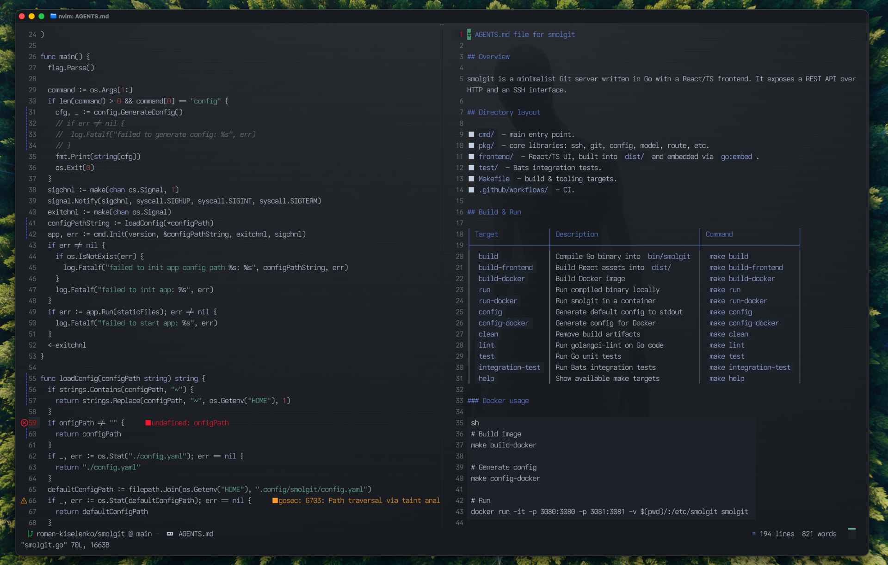

# NVIM

## Overview

Neovim configuration for `golang` development, `nvim-treesitter` free.

The configutaion structure follows `Many` approach described in the [A Guide to vim.pack (Neovim built-in plugin manager)](https://echasnovski.com/blog/2026-03-13-a-guide-to-vim-pack.html#many-vim-pack-add)

    

Based on [mcauley-penney](https://github.com/mcauley-penney/nvim) dotfiles.

## Requirements

1. nvim >= 0.12.2
1. [`yaml-language-server`](https://github.com/redhat-developer/yaml-language-server) - can be installed via `yarn global add yaml-language-server`
1. [`fzf`](https://github.com/junegunn/fzf) - for fzf-lua
1. `go install github.com/nametake/golangci-lint-langserver@latest` & `go install github.com/golangci/golangci-lint/cmd/golangci-lint@latest` - for golangci_lint_ls
1. [`lazygit`](https://github.com/jesseduffield/lazygit)
1. [`prettier`](https://prettier.io) - can be installed via `yarn global add prettier`
